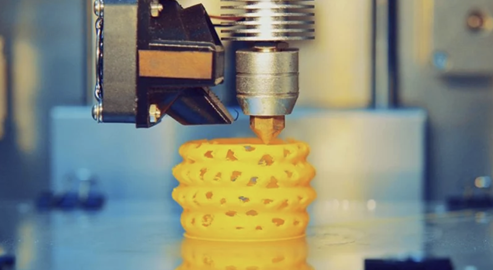
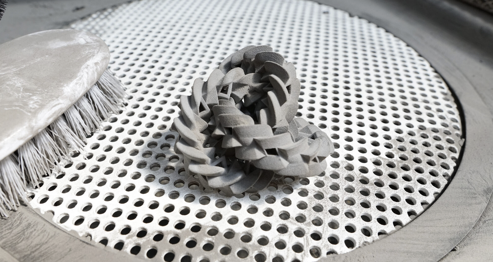
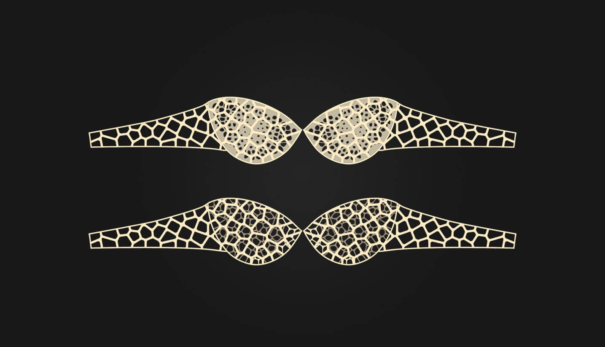

# Tècniques d'impressió 3D

## FDM (Fused Deposition Modeling)

[The Complete Guide to FDM](https://desis.osu.edu/seniorthesis/index.php/2021/09/03/the-complete-guide-to-fused-deposition-modeling-fdm-in-3d-printing/)

## SLA (Stereolithography)

[Stereolithography wikipedia](https://en.wikipedia.org/wiki/Stereolithography)

# SLS (selective laser sintering)

[SLS](https://formlabs.com/es/blog/que-es-sinterizado-selectivo-laser/)

## Paste Printing

  
  

## Impact Printing

[ETH ZURICH](https://dfab.ch/news/impact-printing-wins-3d-pioneers-challenge)

## Altres

[Neyla Coronel FitsYou](https://class.textile-academy.org/2025/neyla-coronel/development/05-First%20Prototypes/)
---

  
&nbsp; &nbsp; &nbsp; &nbsp;
  
&nbsp; &nbsp; &nbsp; &nbsp;
  

