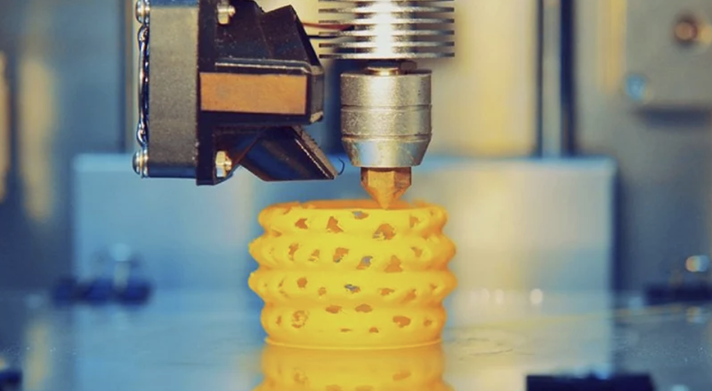
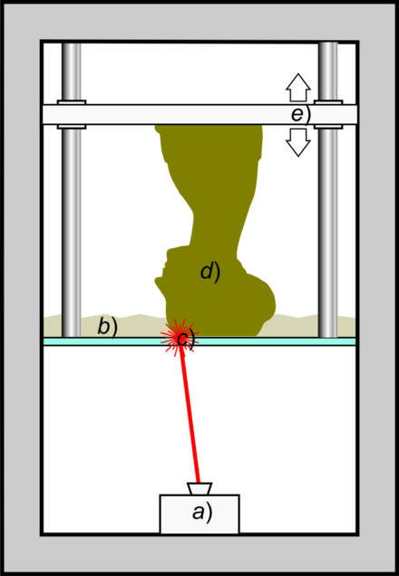
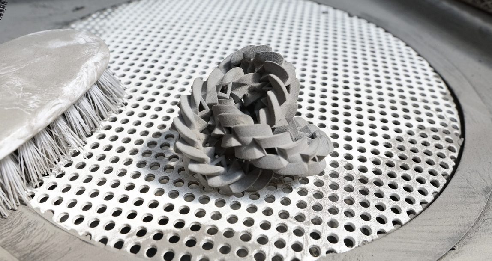
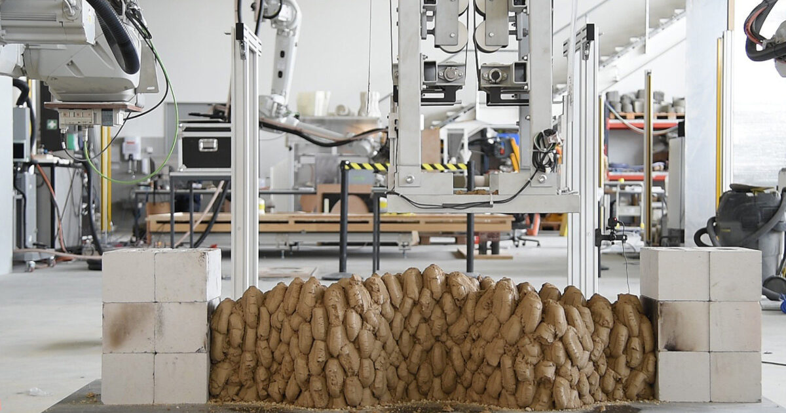
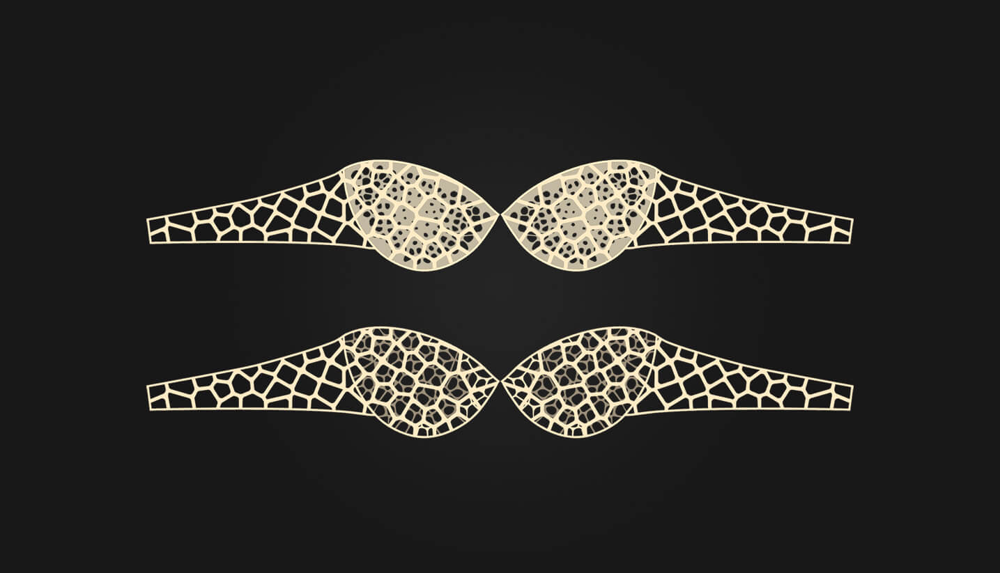

# Tècniques d'impressió 3D

<h2>FDM (Fused Deposition Modeling)</h2>

- [The Complete Guide to FDM](https://desis.osu.edu/seniorthesis/index.php/2021/09/03/the-complete-guide-to-fused-deposition-modeling-fdm-in-3d-printing/)

<h2>SLA (Stereolithography)</h2>

- [Stereolithography wikipedia](https://en.wikipedia.org/wiki/Stereolithography)

<h2>SLS (Selective Laser Sintering)</h2>

- [SLS](https://formlabs.com/es/blog/que-es-sinterizado-selectivo-laser/)

<h2>Paste Printing</h2>

  
  

<h2>Impact Printing</h2>

- [ETH ZURICH](https://dfab.ch/news/impact-printing-wins-3d-pioneers-challenge)

<h2>Altres</h2>

- [Neyla Coronel FitsYou](https://class.textile-academy.org/2025/neyla-coronel/development/05-First%20Prototypes/)

---

  
  &nbsp; &nbsp; &nbsp; &nbsp;
  
  &nbsp; &nbsp; &nbsp; &nbsp;
  

