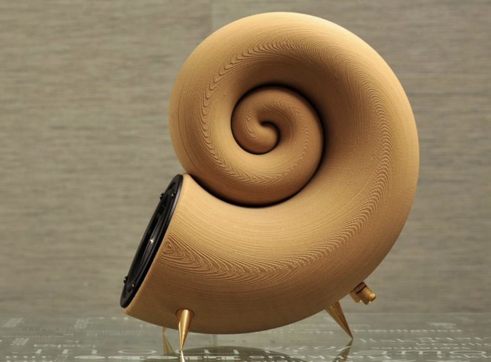
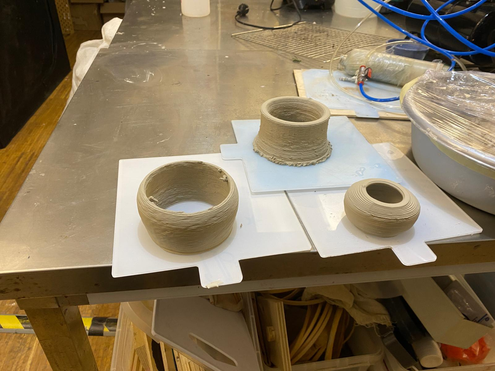

# Materials

> *Molta artenció a les consideracions del fabricant (temperatures de fusió, emmagatzematge...)*

<h2>PLA</h2>

- polímer renovable d'origen vegetal
- baixos volàtils, partícules fines
- més fàcil d'imprimir
- més fràgil

<h2>PETG</h2>

- polímer reciclable d'origen petrolier
- baixos volàtils, partícules fines
- més resistent, millor resistència UV

<h2>Altres</h2>

- Polímers: PMMA, ABS, HIPS, TPU, PVA, ...
- metalls
- fustes
- ....

- [Metal 3D printing fabrication](https://www.allmetalsfab.com/3d-printings-impact-on-the-metal-fabrication-industry/)

- [Wood speaker](https://3dprint.com/5188/akemake-first-3d-printed-wood-speaker/)

---

  
  &nbsp; &nbsp; &nbsp; &nbsp;
  
  &nbsp; &nbsp; &nbsp; &nbsp;
  

