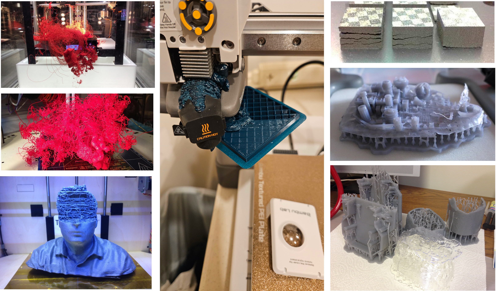
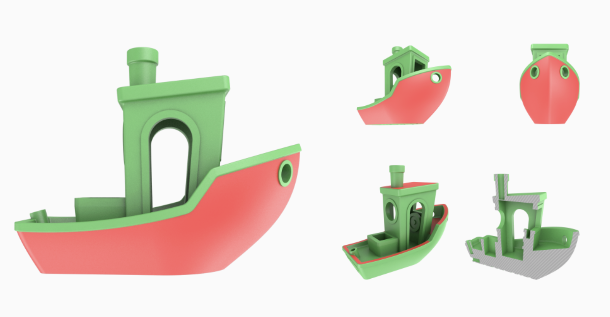
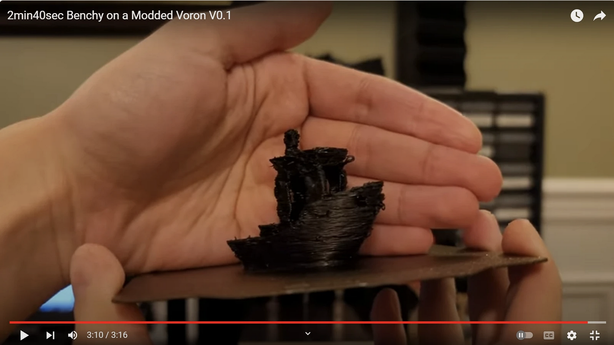
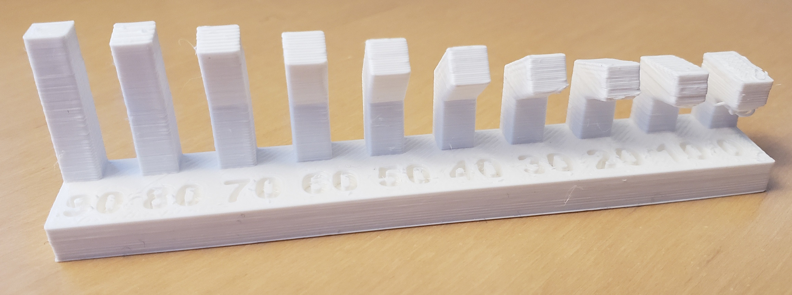
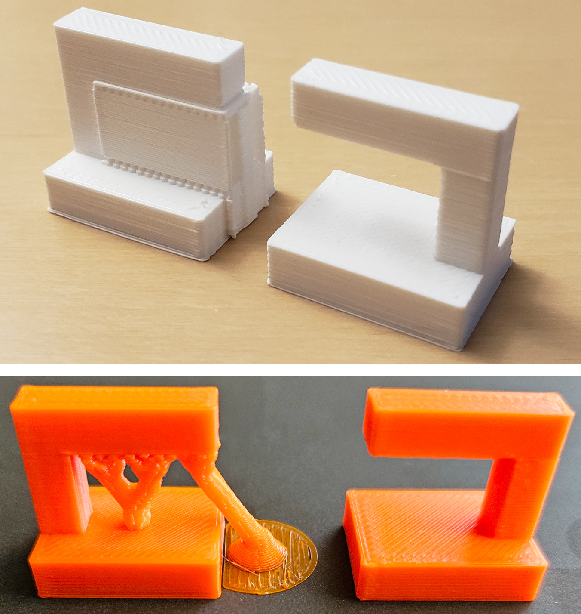
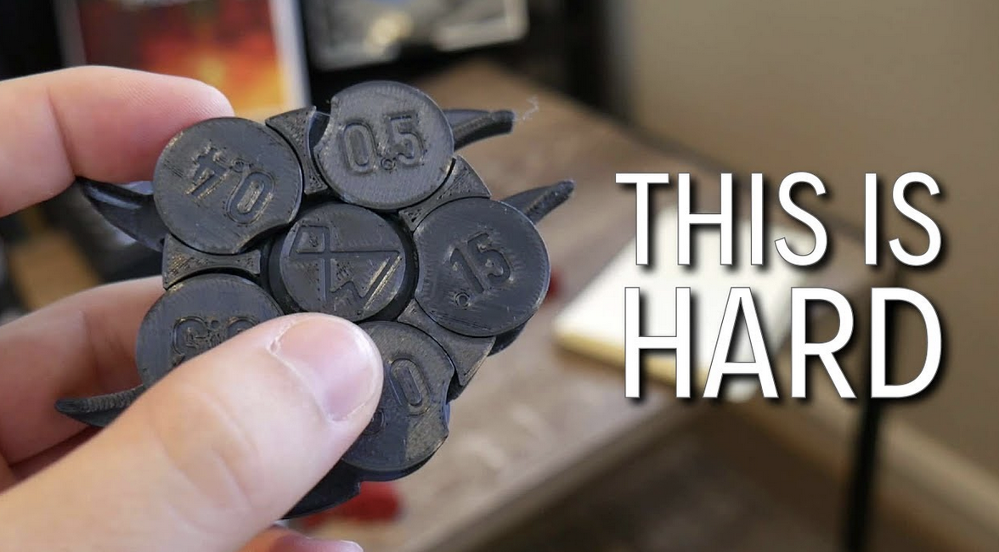

# Errors i Restriccions

- [FabAcademy 3d printing week](https://academy.cba.mit.edu/classes/scanning_printing/index.html)

<h2>Benchmark</h2>

- [Benchy](https://www.3dbenchy.com/features/)
- [Benchy speed](https://stldenise3d.com/speed-benchy-settings-and-rules/)

<h2>Errors</h2>

<h3>Inclinacions</h3>

- [FabAcademy 3d printing week](https://academy.cba.mit.edu/classes/scanning_printing/index.html)

<h3>Suports</h3>

- [FabAcademy 3d printing week](https://academy.cba.mit.edu/classes/scanning_printing/index.html)

<h3>Toleràncies</h3>

- [Clearance test](https://www.youtube.com/shorts/gc_7rT5UppU)

---

  
  &nbsp; &nbsp; &nbsp; &nbsp;
  
  &nbsp; &nbsp; &nbsp; &nbsp;
  

