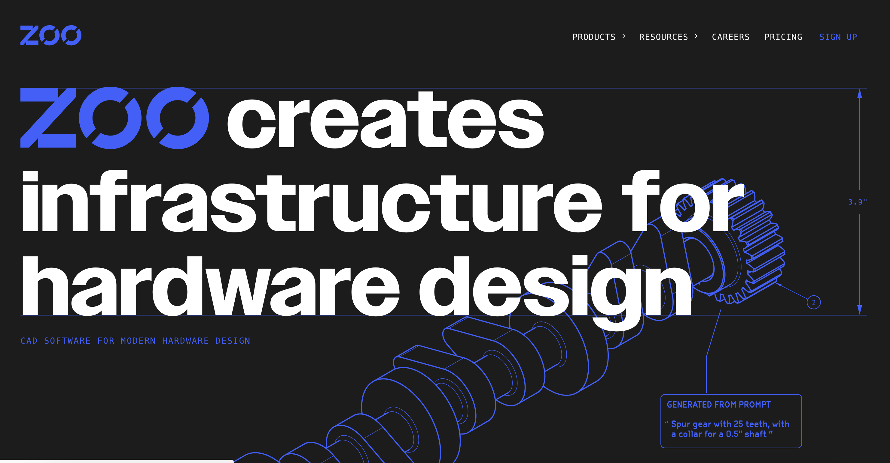
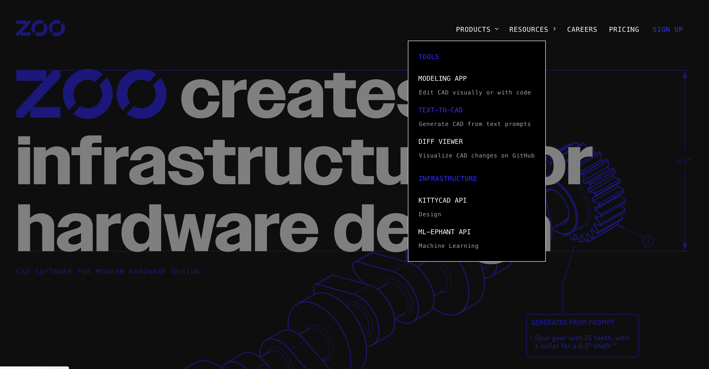
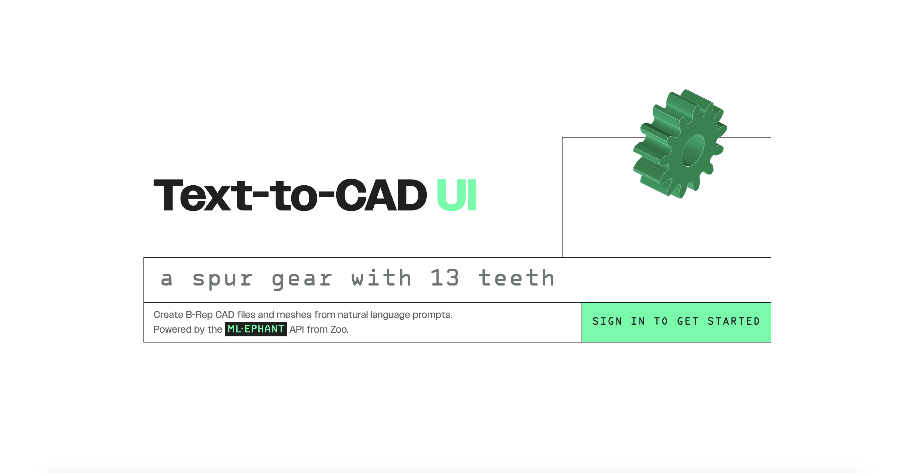
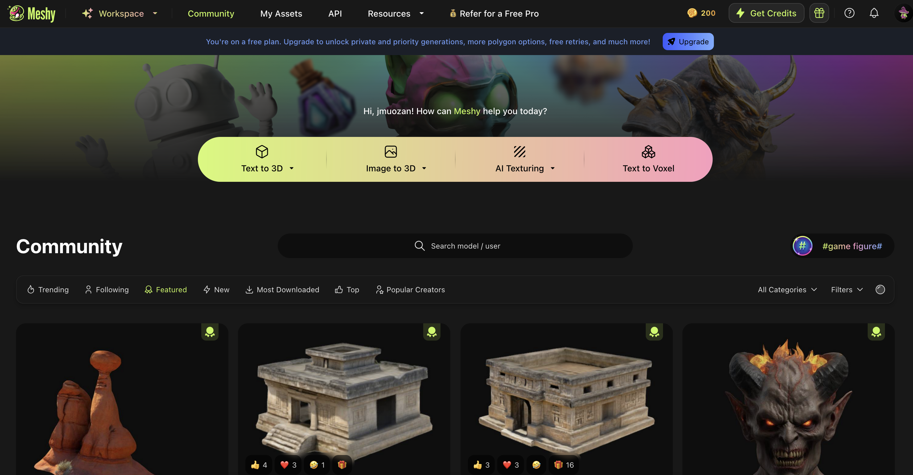
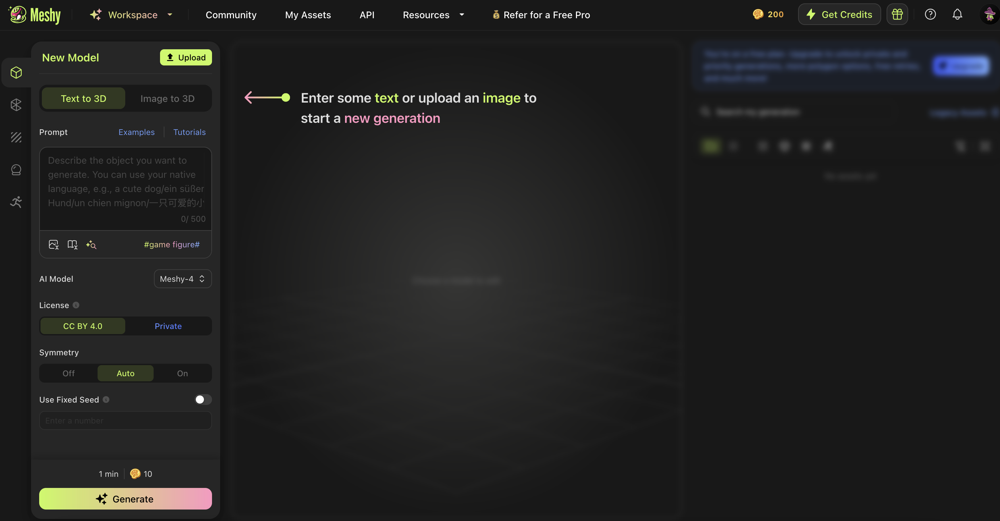

# Pàgines d'interés

<h2>Bancs de models</h2>

Pàgines on podeu descarregar models 3d gratuitament. (Mireu el tipus de llicencia associada a cada un del models, pot ser vos demanen citar l'autor)

- [Threedscans](https://threedscans.com/)
- [CG Trader](https://www.cgtrader.com/)
- [Turbo Squid](https://www.turbosquid.com/)
- [Sketchfab](https://sketchfab.com/)

<h2>Ferramentes IA</h2>

<h3>ZOO CAD</h3>

- [ZOOCAD](https://zoo.dev/)

<h3>Meshy</h3>

- [Meshy](https://www.meshy.ai/discover)

---

  
  &nbsp; &nbsp; &nbsp; &nbsp;
  
  &nbsp; &nbsp; &nbsp; &nbsp;
  

