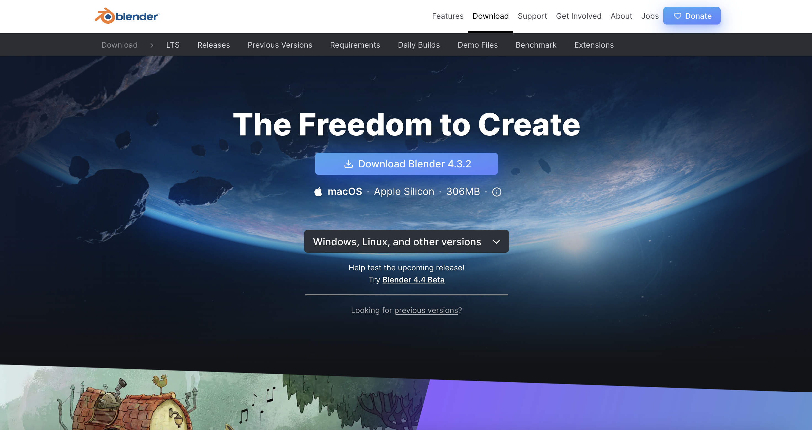

# Programari

## Programari pel disseny 3D

### Blender

Programa *Open Source*, gratis i amb infinitat de recursos i tutorials (Curva d'aprenentatje elevada). Disponible a macos, windows i linux. 

[Blender download](https://www.blender.org/download/)

### Rhino3D

Preferència personal, prova d'acces de 90 dies donant el correu i una gran comunitat darrere. gran quantitat de reucrsos i *plug-ins* online. Disponible a macos i windows.

[Prova Rhino](https://www.rhino3d.com/download/)

### TINKERCAD

---

  
&nbsp; &nbsp; &nbsp; &nbsp;
  
&nbsp; &nbsp; &nbsp; &nbsp;
  

