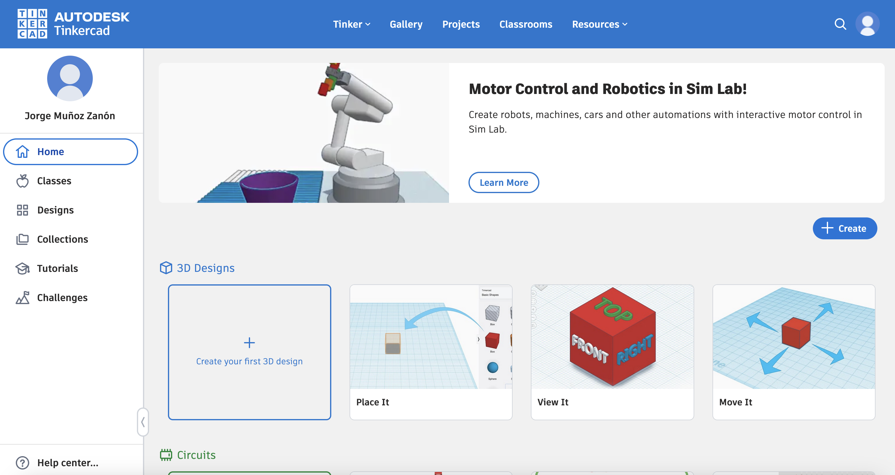
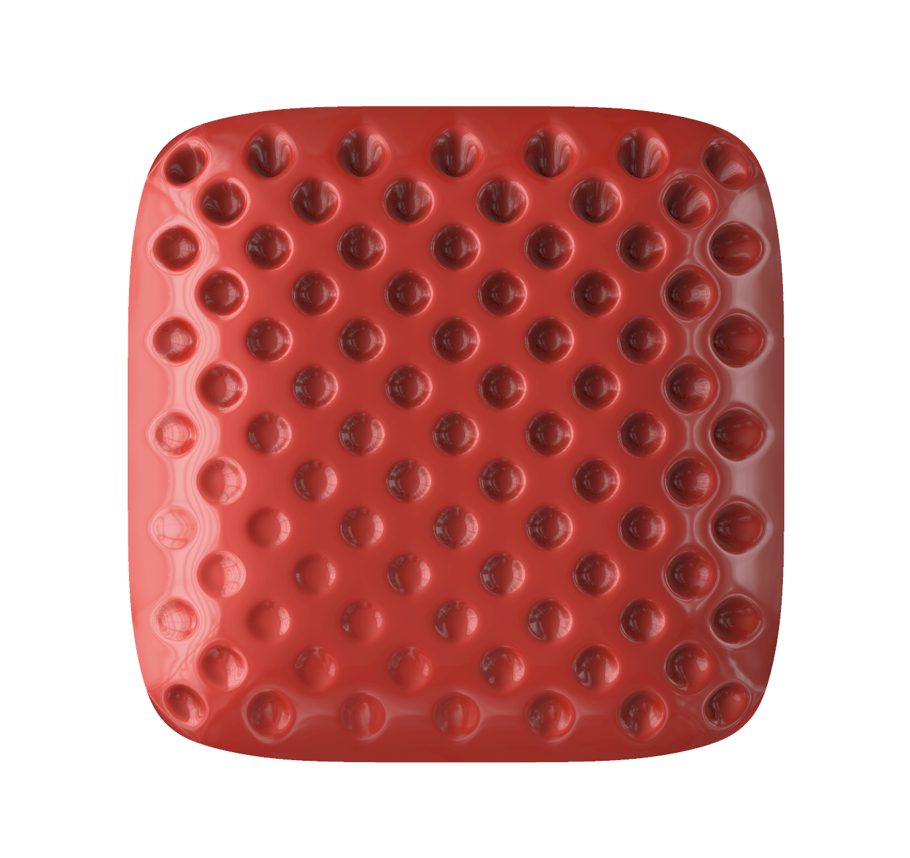

# Programari

## Programari pel disseny 3D

### Blender

Programa *Open Source*, gratis i amb infinitat de recursos i tutorials (Curva d'aprenentatje elevada). Disponible a macos, windows i linux. 


[Blender download](https://www.blender.org/download/)

### Rhino3D

Preferència personal, prova d'acces de 90 dies donant el correu i una gran comunitat darrere. gran quantitat de reucrsos i *plug-ins* online. Disponible a macos i windows.


[Prova Rhino](https://www.rhino3d.com/download/)

[Ttorial Rhino](https://youtu.be/lbWv1LVHdMg?si=ybskEmhKnH0EfLhi)

### TINKERCAD

Programa gratuit d'Autodesk focus educatiu. Molt simple i molts recursos d'autodesk.




[Tutorial TinkerCAD](https://www.youtube.com/results?search_query=tinkercad+tutrorial)

### SKETCHUP

Versió web gratis, permet descarregar els models en format ```.stl```. Versió web limitada. Molt senzill aprendre'l


[](https://www.sketchup.com/en/plans-and-pricing/sketchup-free)

### FUSION360

Software paramètric d'Autodesk. Senzill aprendre'l però amb opcions molt avançades. Versió limitada per a hobbistes gratis (no comercial) i versió completa per estudiants. Tot el contiungut queda guardat al núvol.


[](https://www.autodesk.com/campaigns/fusion-360/download)


### FREECAD

Altra opció *Open Source*. 


[FreeCAD](https://www.freecad.org/)


## De bits a àtoms: Com imprimim?

### *Meshes* / Malles

<div style="display: flex; gap: 10px;">
  
  
</div>


## Programari per impressió


### *Slicing*


[FABACADEMY WEBSITE](https://fablabbcn-projects.gitlab.io/learning/educational-docs/fabacademy/classes/05-3DScanningandPrinting/)


---
<p align="left">
  
&nbsp; &nbsp; &nbsp; &nbsp;
  
&nbsp; &nbsp; &nbsp; &nbsp;
  
</p>