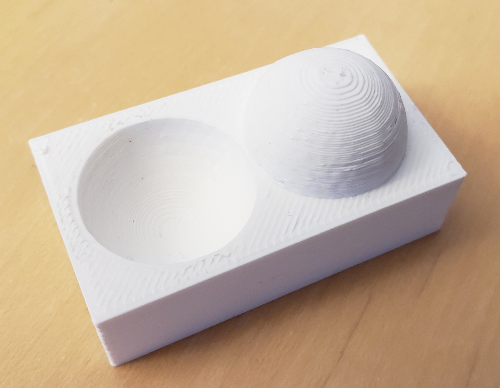
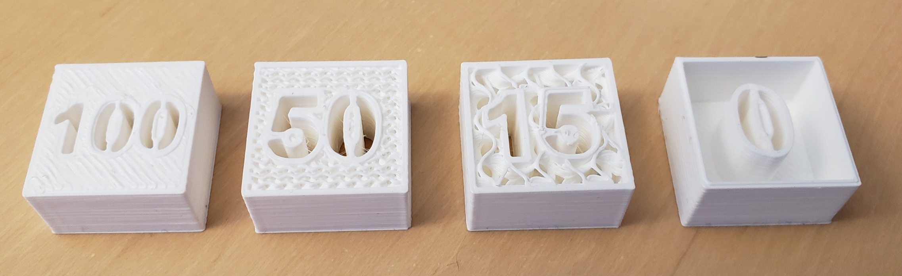
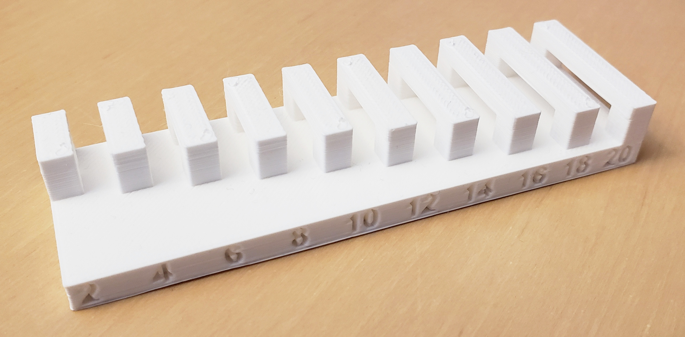

# Consideracions

## Mesh

### Formats

```.stl``` ```.obj``` ```.fbx``` ```.gltf``` ```.3mf```

### Subdivisions

[](./IMG/CONSIDERATIONS/cilindre.png)
[](./IMG/CONSIDERATIONS/cilindresub.png)
[](./IMG/CONSIDERATIONS/cilindresubtop.png)


## gcode
### ?

CODI màquina de bits a àtoms. Moviments finits
[Info stl ASCII](../FORMES_BÀSIQUES/STL.md)

### Altra de capa


[FabAcademy 3d printing week](https://academy.cba.mit.edu/classes/scanning_printing/index.html)


### infill


[FabAcademy 3d printing week](https://academy.cba.mit.edu/classes/scanning_printing/index.html)


### bridging


[FabAcademy 3d printing week](https://academy.cba.mit.edu/classes/scanning_printing/index.html)

