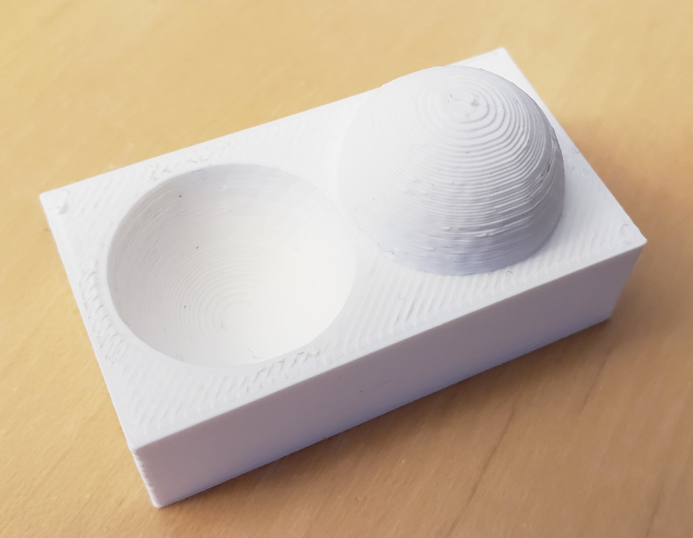
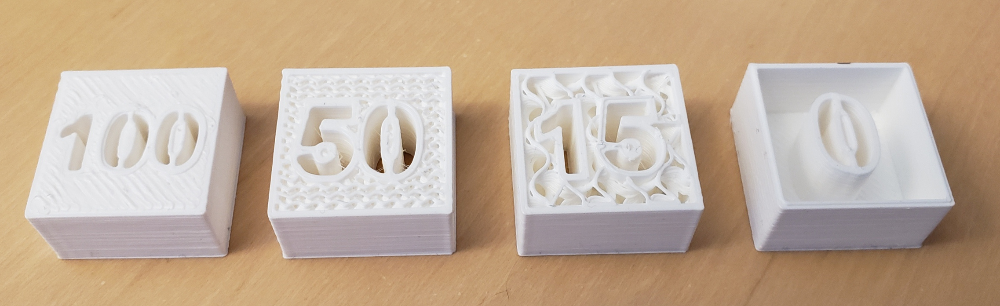
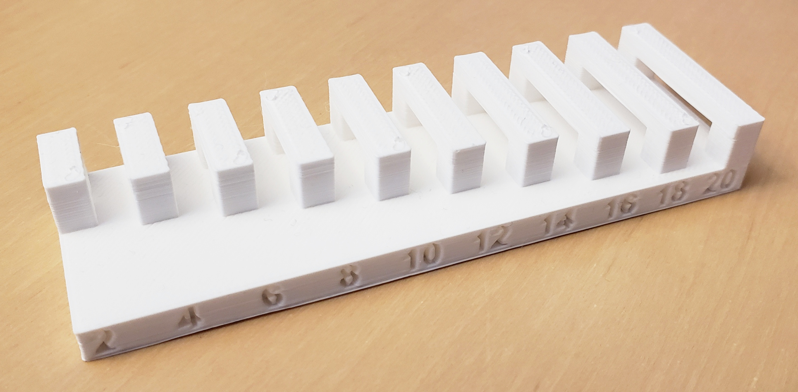

# Consideracions

<details>
<summary><h2>Mesh</h2></summary>

<details>
<summary><h3>Formats</h3></summary>

```.stl``` ```.obj``` ```.fbx``` ```.gltf``` ```.3mf```

</details>

<details>
<summary><h3>Subdivisions</h3></summary>


</details>

</details>

<details>
<summary><h2>Gcode</h2></summary>

CODI màquina de bits a àtoms. Moviments finits

- [Info stl ASCII](../FORMES_BÀSIQUES/STL.md)

<details>
<summary><h3>Alçada de capa</h3></summary>



- [FabAcademy 3d printing week](https://academy.cba.mit.edu/classes/scanning_printing/index.html)

</details>

<details>
<summary><h3>Infill</h3></summary>



- [FabAcademy 3d printing week](https://academy.cba.mit.edu/classes/scanning_printing/index.html)

</details>

<details>
<summary><h3>Bridging</h3></summary>



- [FabAcademy 3d printing week](https://academy.cba.mit.edu/classes/scanning_printing/index.html)

</details>

</details>

---
<p align="left">
  
  &nbsp; &nbsp; &nbsp; &nbsp;
  
  &nbsp; &nbsp; &nbsp; &nbsp;
  
</p>
