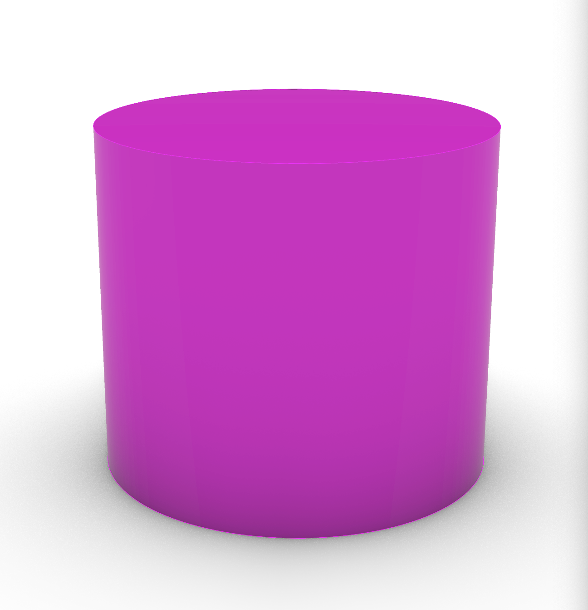
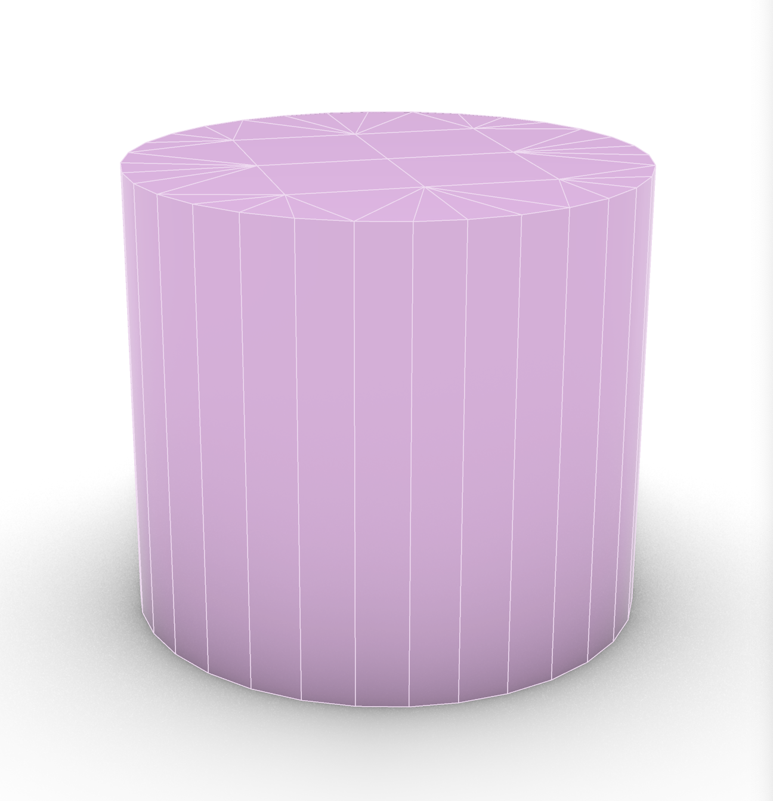
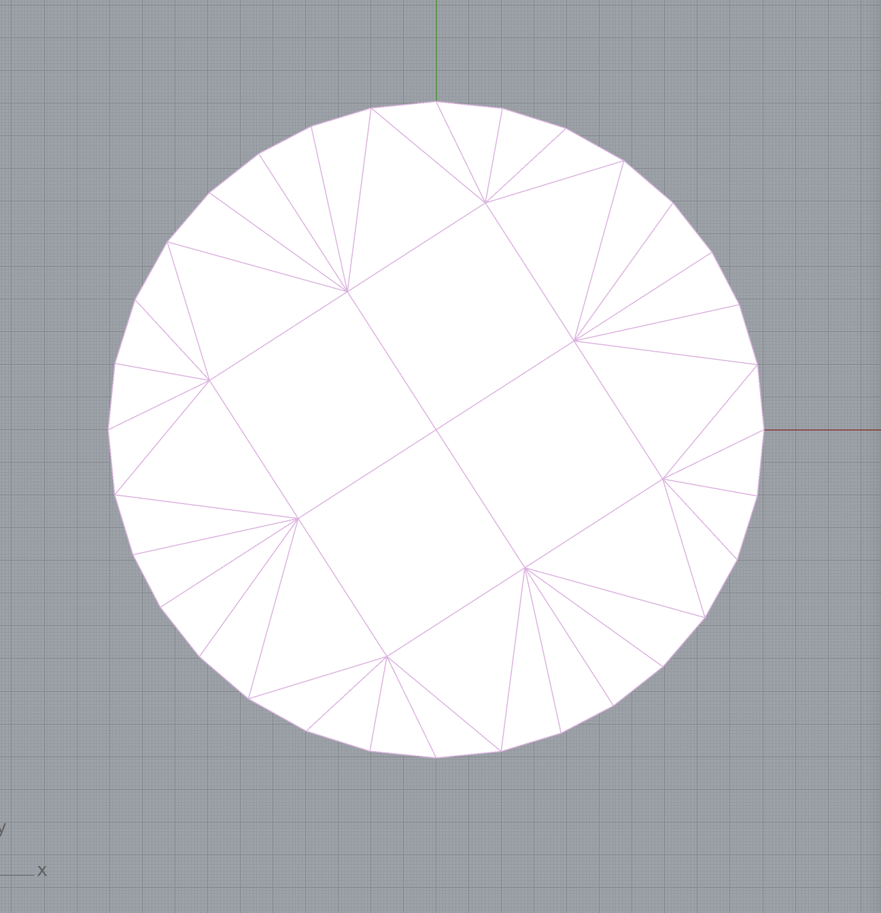

# Consideracions

## Mesh

### Formats

```.stl``` ```.obj``` ```.fbx``` ```.gltf``` ```.3mf```

### Subdivisions





---

## Gcode

CODI màquina de bits a àtoms. Moviments finits

- [Info stl ASCII](../FORMES_BÀSIQUES/STL.md)

### G0 G1 G2 G3...

```
G0 X10 Y10; moviment ràpid (sense extrusió)
G1 X20 Y20 E5; moviment lineal amb extrusió
G2 X30 Y10 I5 J0; arc en sentit horari
G28; home (origen)
M104 S200; temperatura hotend
M140 S60; temperatura llit
```

- `G0` — Moviment ràpid (travel), sense extrudir material
- `G1` — Moviment lineal controlat, amb extrusió opcional (`E`)
- `G2/G3` — Moviment en arc (horari / antihorari)
- `G28` — Anar a la posició d'origen
- `M104/M140` — Establir temperatures

---
<p align="left">
  
  &nbsp; &nbsp; &nbsp; &nbsp;
  
  &nbsp; &nbsp; &nbsp; &nbsp;
  
</p>
