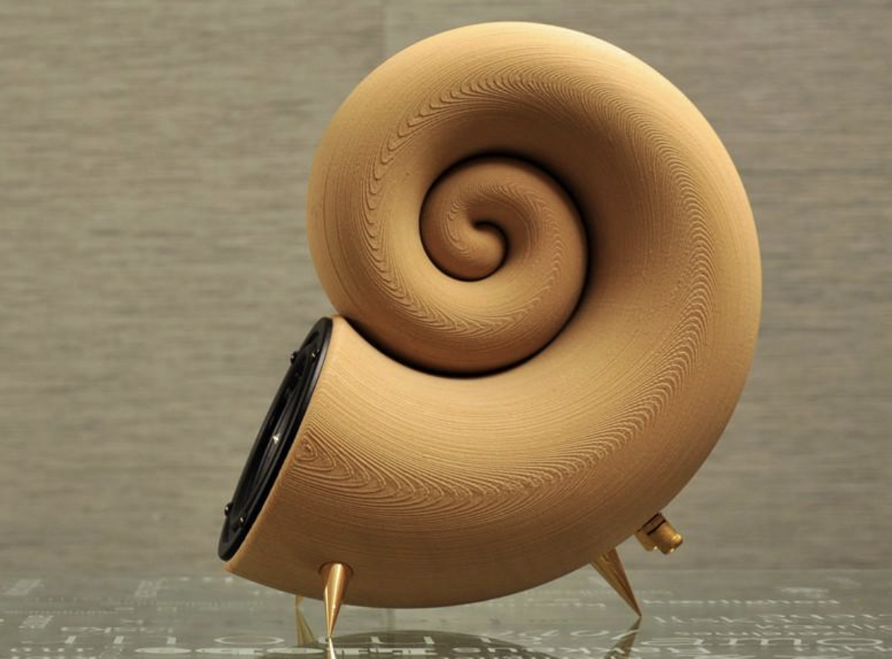
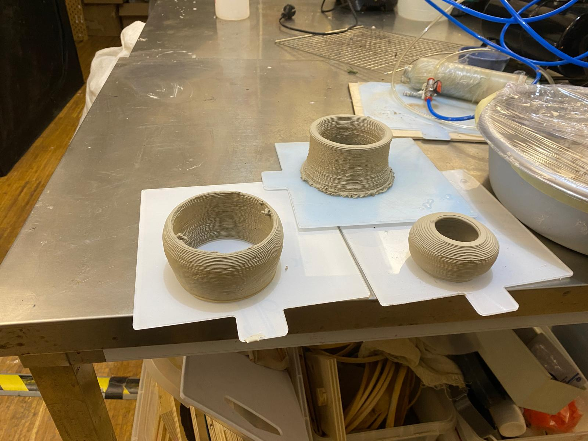

# Materials

##*Molta artenció a les consideracions del fabricant (temperatures de fusió, emmagatzematge...)

- PLA:
    - polímer renovable d'origen vegetal
    - baixos volàtils, partícules fines
    - més fàcil d'imprimir
    - més fràgil

- PETG:
    - polímer reciclable d'origen petrolier
    - baixos volàtils, partícules fines
    - més resistent, millor resistència UV
        
- Altres:
    - Polímers: PMMA, ABS, HIPS, TPU, PVA, ...
    - metalls 
    - fustes
    - ....

[metal 3d printing fabrication](https://www.allmetalsfab.com/3d-printings-impact-on-the-metal-fabrication-industry/)

[wood speaker](https://3dprint.com/5188/akemake-first-3d-printed-wood-speaker/)

