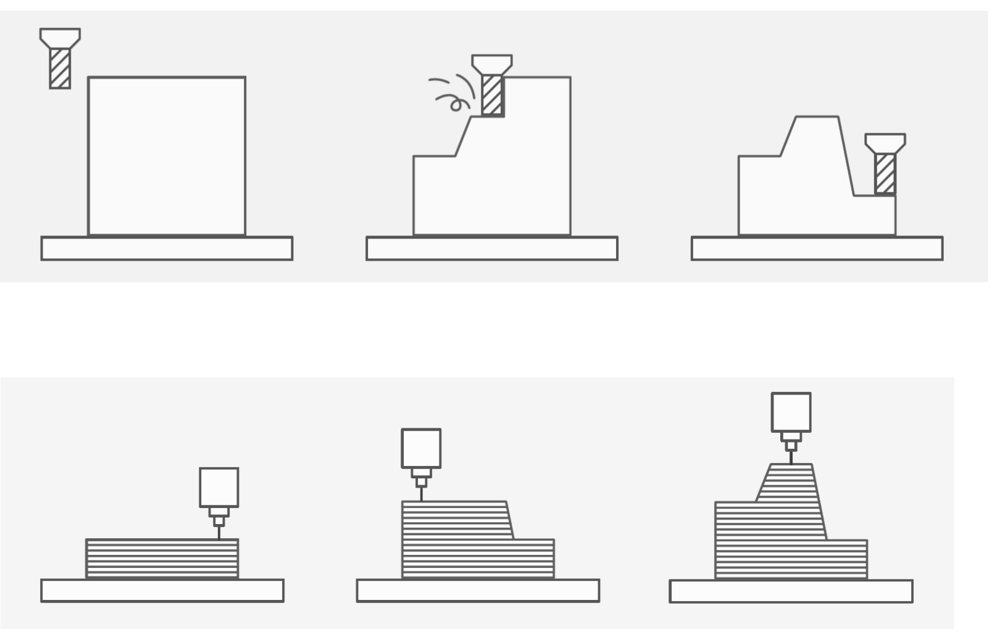
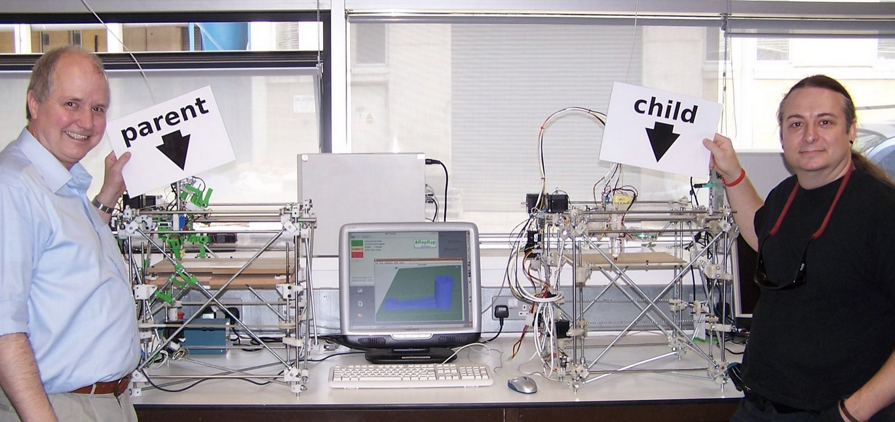
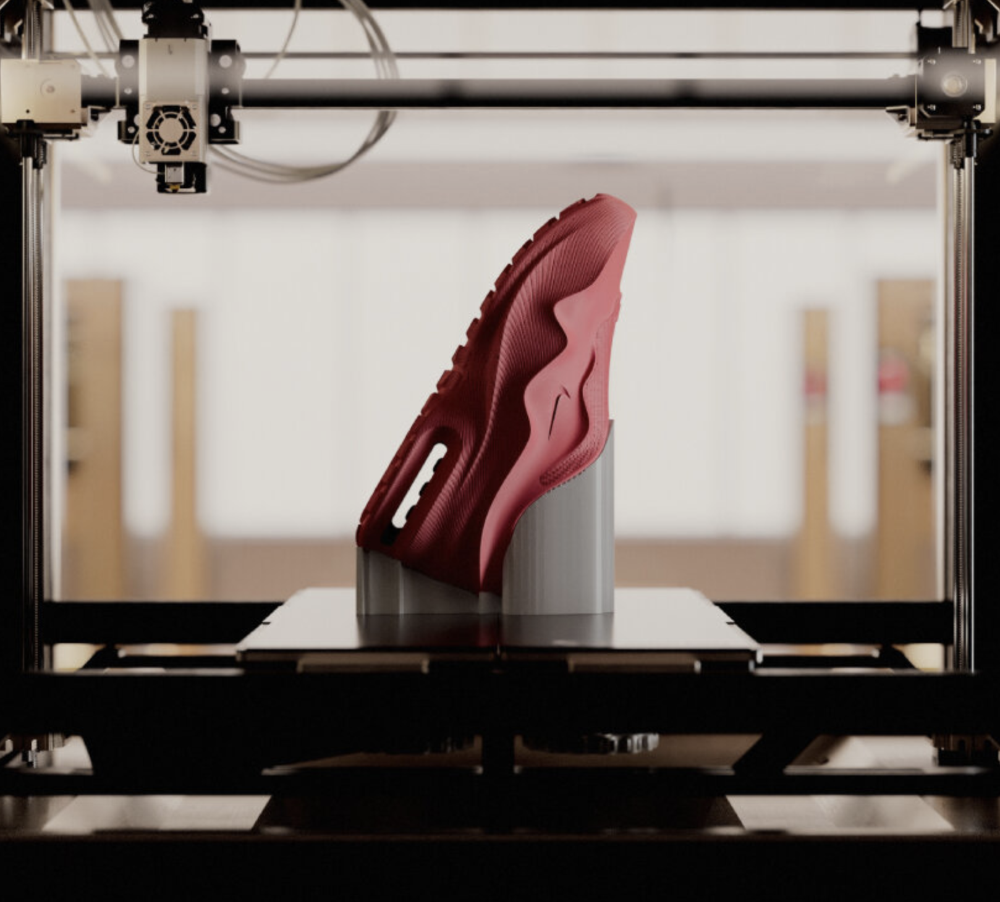
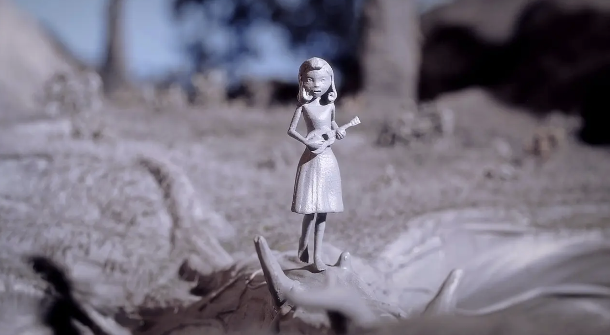

# Jornades JEDAI Taller d'Impressió 3D

## Processos subtractius vs additius

  
  

## Impressió 3D. Per qué mola??

  - Accessibilitat

  

[RepRap selfreplicating](http://fab.cba.mit.edu/classes/865.18/replication/Jones.pdf)
[reprap wiki](https://reprap.org/wiki/About)
  - Sostenibilitat

  
  

[Zellerfeld](https://www.zellerfeld.com/)
[Zellerfeld + Nike](https://about.nike.com/en/newsroom/releases/nike-sneaker-culture-complexcon)

[IaaC 3DPA](https://iaac.net/3dpa-directors-explore-additive-manufacturing-in-construction/)
  - Personalitazació (Empoderament dels usuaris)

[3D Printing Your Favorite Heroes: Hasbro Does Mass Customization](https://formlabs.com/blog/formlabs-hasbro-3d-printing-mass-customization/)

[Chase Me: A 3D printed film created on the Form 1+](https://formlabs.com/blog/chase-me-3d-printed-film/)

  
  

[Hotels per insectes](https://www.3dwasp.com/en/3d-printed-ceramic-sculptures-to-house-insects/)

## Sobre la Impressió 3D: Qué farem al workshop?

 - [Tècniques d'impressió 3D:](DOCUMENTS/1_TÈCNIQUES.md) Com s'imprimeix??
 
 - [Materials:](DOCUMENTS/MATERIALS.md) Posibilitats materials

 - [Errors i restriccions habituals:](DOCUMENTS/2_ERRORS+RESTRICCIONS.md) Exemples d'errors i restriccions d'impressió

 - [On trobar models 3D?:](DOCUMENTS/4_PÀG3D.md) No vull modelar res només imprimir

 - [Programari:](DOCUMENTS/5_PROGRAMARI.md) Programes de modelat tridimensional i *slicing*

 - [3D, Aspectes essencials:](DOCUMENTS/6_CONSIDERACIONS.md) Qué cal tindre en compte a l'hora d'imprimir els meus arxius?

## Imprimim??

---

  
&nbsp; &nbsp; &nbsp; &nbsp;
  
&nbsp; &nbsp; &nbsp; &nbsp;
  

  - [x] Tecn
  - [x] Mat
  - [ ] Errors
  - [ ] Pàg
  - [ ] Programari
  - [ ] Malles