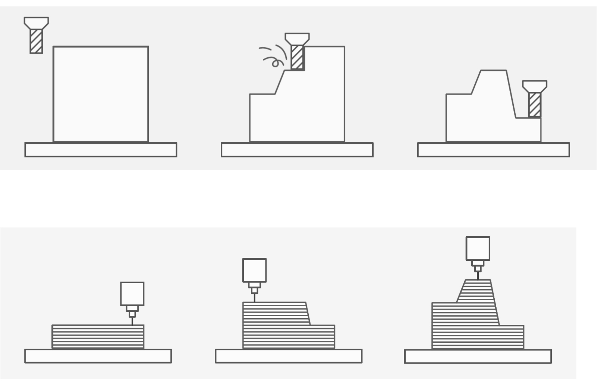
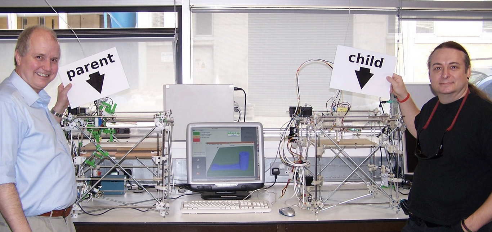
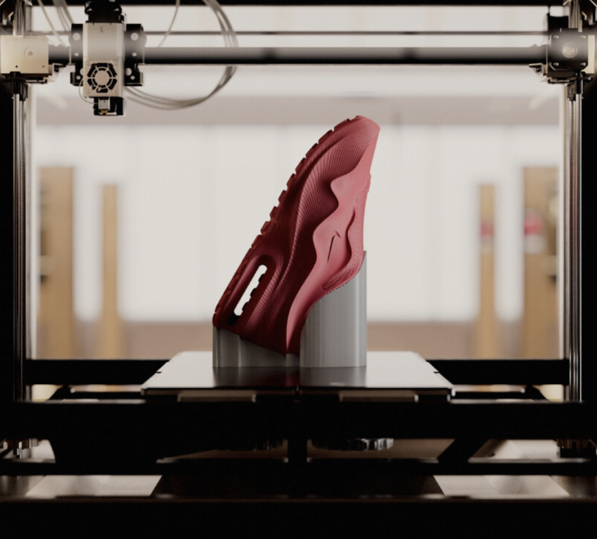
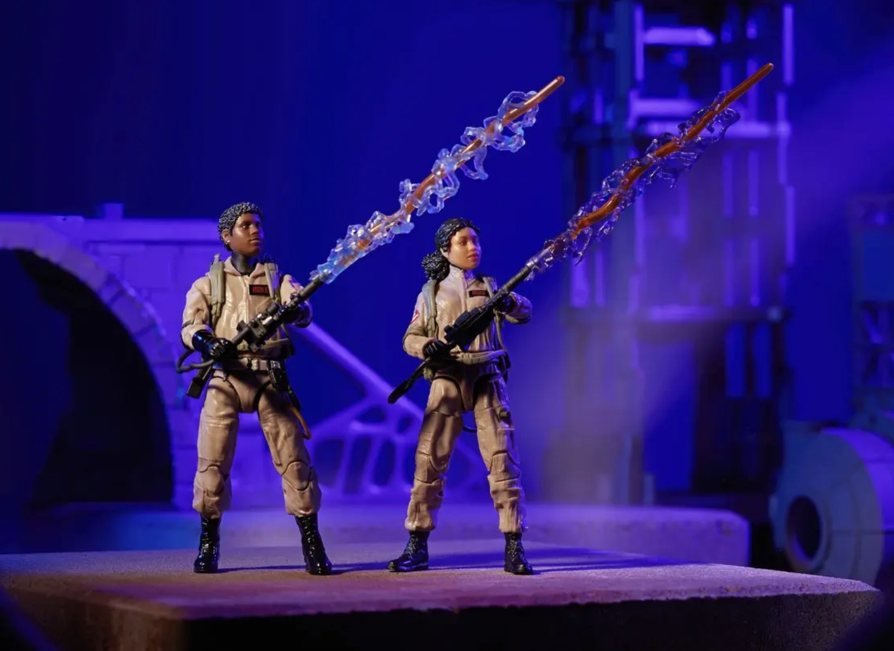
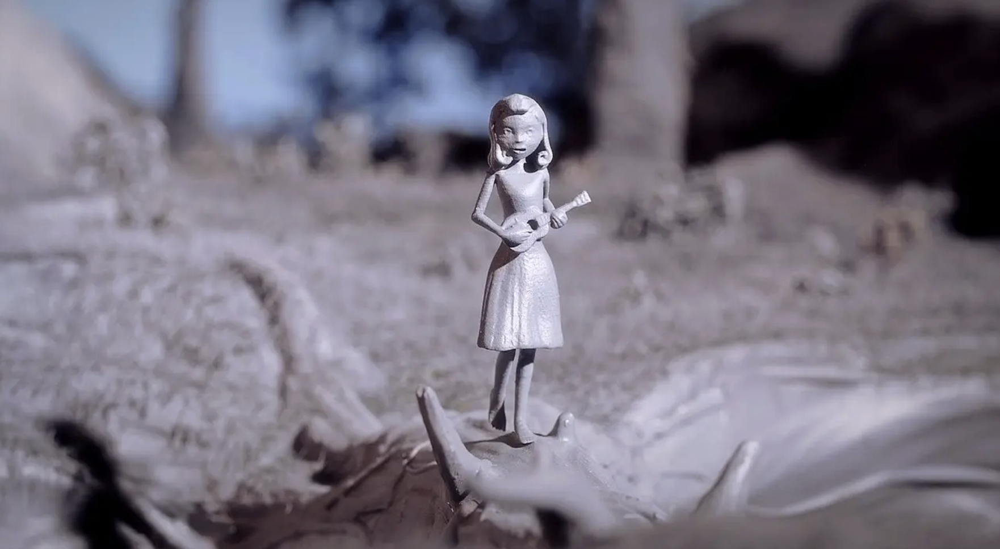
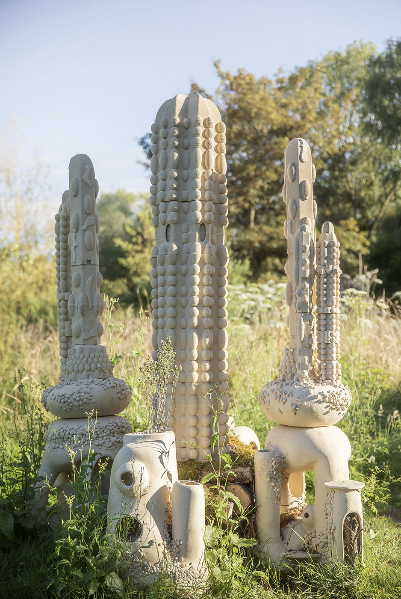
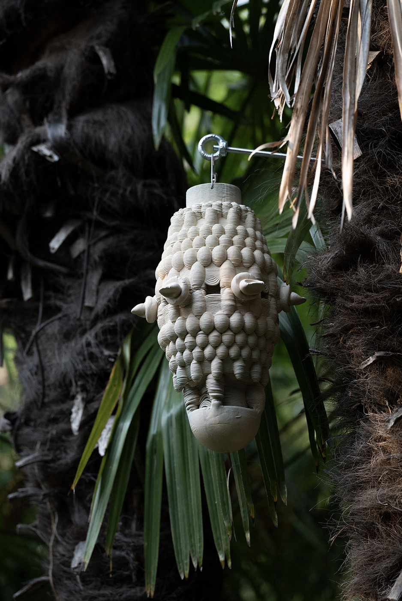

# Jornades JEDAI — Taller d'Impressió 3D

  
  

<h2>Processos subtractius vs additius</h2>

  
  

<h2>Impressió 3D. Per qué mola?</h2>

<h3>Accessibilitat</h3>

  

- [RepRap selfreplicating](http://fab.cba.mit.edu/classes/865.18/replication/Jones.pdf)
- [RepRap wiki](https://reprap.org/wiki/About)

<h3>Sostenibilitat</h3>

  
  

- [Zellerfeld](https://www.zellerfeld.com/)
- [Zellerfeld + Nike](https://about.nike.com/en/newsroom/releases/nike-sneaker-culture-complexcon)

- [IaaC 3DPA](https://iaac.net/3dpa-directors-explore-additive-manufacturing-in-construction/)

<h3>Personalització (Empoderament dels usuaris)</h3>

- [3D Printing Your Favorite Heroes: Hasbro Does Mass Customization](https://formlabs.com/blog/formlabs-hasbro-3d-printing-mass-customization/)

- [Chase Me: A 3D printed film created on the Form 1+](https://formlabs.com/blog/chase-me-3d-printed-film/)

  
  

- [Hotels per insectes](https://www.3dwasp.com/en/3d-printed-ceramic-sculptures-to-house-insects/)

<h2>Sobre la Impressió 3D: Qué farem al workshop?</h2>

- [Tècniques d'impressió 3D](DOCUMENTS/1_TÈCNIQUES.md) — Com s'imprimeix?
- [Materials](DOCUMENTS/2_MATERIALS.md) — Possibilitats materials
- [Errors i restriccions habituals](DOCUMENTS/3_ERRORS+RESTRICCIONS.md) — Exemples d'errors i restriccions d'impressió
- [On trobar models 3D?](DOCUMENTS/4_PÀG3D.md) — No vull modelar res, només imprimir
- [Programari](DOCUMENTS/5_PROGRAMARI.md) — Programes de modelat tridimensional i *slicing*
- [3D, Aspectes essencials](DOCUMENTS/6_CONSIDERACIONS.md) — Què cal tenir en compte a l'hora d'imprimir els meus arxius?

<h2>Imprimim?</h2>

  
  &nbsp; &nbsp; &nbsp; &nbsp;
  
  &nbsp; &nbsp; &nbsp; &nbsp;
  

